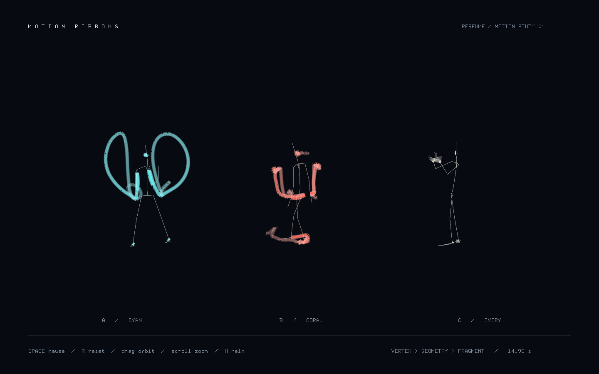
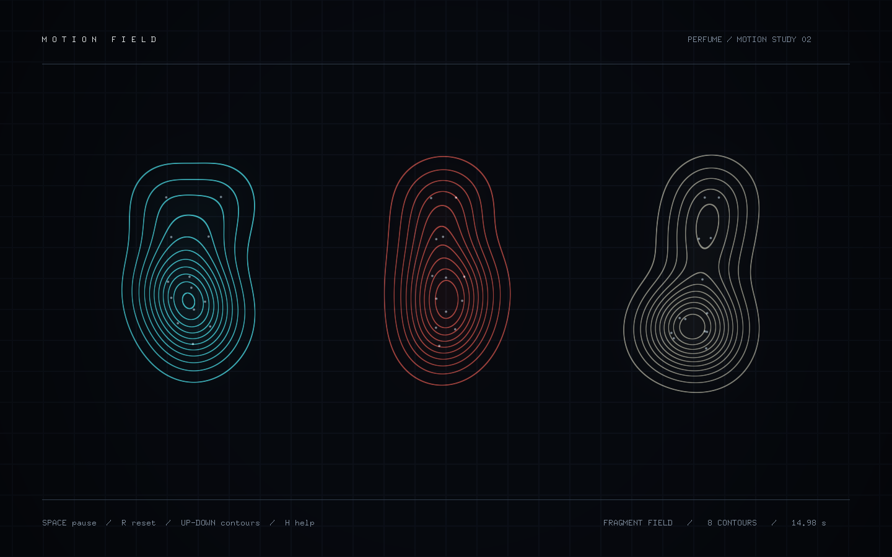

# Perfume Global Site — openFrameworks examples

[](https://github.com/perfume-dev/example-openFrameworks/actions/workflows/build.yml)

Motion-capture studies for [openFrameworks 0.12.1](https://openframeworks.cc/download/).
The six examples from the 2012 Perfume “Global Site Project” now use the
programmable OpenGL 3.2 renderer, `ofApp`, member-owned state, and mesh-based
drawing. Two new shader studies turn the bundled motion into luminous ribbons
and animated contour fields.

## Start with the shader studies

| Example | What you see | What you learn |
| --- | --- | --- |
| [Motion Ribbons](example-motion-ribbons) | Fine luminous trails following the dancers | Vertex, geometry, and fragment shaders; expanding a line into a ribbon |
| [Motion Field](example-motion-field) | Contours and halos around moving joints | Passing motion to a full-screen fragment shader |





These are actual application captures, not concept images. The studies recenter
horizontal root travel to keep the three dancers legible; they show the recorded
poses rather than reconstructing the original stage formation.

Both use the existing bundled BVH samples and need no external addons or audio
downloads. The [shader guide](docs/shaders.md) explains the rendering stages and
where to start editing. Companion studies are available in the
[Processing repository](https://github.com/perfume-dev/example-processing).

## Stewardship

The [perfume-dev organization](https://github.com/perfume-dev) was founded by
Daito Manabe in 2012 and has remained under his stewardship since launch. He
continues to oversee maintenance of this repository with project collaborators.

Perfume is a Japanese artist group. Manabe's documented collaboration with
Perfume goes back to the
[2010 Tokyo Dome performance](https://daito.ws/archive/perfume_12345678910/),
which credits his programming. The later
[2020 “Time Warp” project](https://daito.ws/en/archive/perfume-imaginary-museum-time-warp-perfume-p-o-p-festival/)
credits him with creative and technical direction and sound-effect design.
Across multiple Perfume projects since 2010, his roles have included creative
direction, technical direction, programming, and sound-related design,
including sound-effect design. For the 2012 Global Site Project, the
[Agency for Cultural Affairs award record](https://www.bunka.go.jp/j-mediaarts-festival/award/single/perfume_global_site_project/index.html)
credits Manabe with planning, direction, and programming, and records the many
artists, choreographers, designers, programmers, engineers, producers, and
supporters who made the project possible.

This stewardship statement does not replace individual authorship. Historical
and third-party credits are preserved in [CONTRIBUTORS.md](CONTRIBUTORS.md),
the per-example README and LICENSE files, the Git history, and vendored source
notices.

## Included projects

| Directory | Purpose |
| --- | --- |
| `example-bvh` | Standalone BVH playback and three bundled sample motions |
| `example-sync-sound` | Synchronised BVH, audio, and motion-trail rendering |
| `example-pen-graphics` | Ribbon-like graphics generated from skeletal motion |
| `particle-motion-example` | Particle forces driven by tracked joints |
| `motion-visualization` | Long-exposure-style joint trajectories |
| `marching-cubes` | A metaball surface driven by skeletal endpoints |
| `example-motion-ribbons` | Geometry-shader ribbons following the bundled motion |
| `example-motion-field` | A joint-driven fragment-shader contour field |
| `ofxBvh` | The bundled BVH loader and player used by every example |

## Build with openFrameworks 0.12.1

Download the official
[openFrameworks 0.12.1 macOS release](https://github.com/openframeworks/openFrameworks/releases/tag/0.12.1),
then place this repository at the standard openFrameworks application depth:

```sh
export OF_ROOT=/absolute/path/to/of_v0.12.1_osx_release
git clone https://github.com/perfume-dev/example-openFrameworks.git \
  "$OF_ROOT/apps/myApps/example-openFrameworks"
cd "$OF_ROOT/apps/myApps/example-openFrameworks"
./scripts/build-all.sh "$OF_ROOT"
```

The script builds all eight applications in Release mode and runs the `ofxBvh`
boundary/malformed-input and marching-cubes lifecycle regression tests. An
individual application can be built with, for example:

```sh
make -C example-bvh Release OF_ROOT="$OF_ROOT"
open example-bvh/bin/example-bvh.app
```

To render every example in a hidden test window and save PNG evidence:

```sh
./scripts/smoke-all.sh /path/to/captures
```

The GitHub workflow performs the same render checks after building. Its
`openframeworks-rendering` artifact contains screenshots and logs. This requires
a desktop OpenGL context, even though the test windows stay hidden. The shader
studies are captured at two motion timestamps to check that their output changes.

The checked-in Xcode projects were regenerated from the openFrameworks 0.12.1
macOS template. They use relative paths and expect the repository layout shown
above. If you put the repository elsewhere, use the Makefiles with an explicit
`OF_ROOT`, or update the projects with the openFrameworks Project Generator.

## Motion and audio data

`example-bvh` is ready to run with its bundled `A_test.bvh`, `B_test.bvh`, and
`C_test.bvh` files. The two new shader studies read those same files. The other
five historical applications first look for the original
Perfume Global Site assets in each application's `bin/data` directory:

```text
bin/data/
├── Perfume_globalsite_sound.wav
└── bvhfiles/
    ├── aachan.bvh
    ├── kashiyuka.bvh
    └── nocchi.bvh
```

Those original full assets are not duplicated in this repository. When they
are absent, the maintained examples fall back to the bundled A/B/C motion
samples and a silent internal clock, so every application can still be built
and explored from a clean checkout. Startup logs identify motion fallback, and
an on-screen notice identifies silent-clock mode.

## Dependencies and licenses

`ofxBvh` is kept in this repository and referenced as a local addon. The
historical `ofxMarchingCubes` source required by `marching-cubes` is vendored
with provenance and its LGPL-2.1-or-later notice under
[`third_party/ofxMarchingCubes`](third_party/ofxMarchingCubes/README.md).
Application and addon license terms remain in their respective directories;
the two examples by Atsushi Tadokoro retain their original copyright and MIT
license notices. See [LICENSES.md](LICENSES.md) for the component-by-component
license index; the repository does not apply one blanket license to every
directory.

The maintained example code uses GLM vectors and mesh drawing. `ofxBvh` retains
its older public vector/matrix types so existing addon consumers continue to
compile; its example rendering supports the programmable renderer. The vendored
marching-cubes dependency retains its upstream public interface and attribution.
